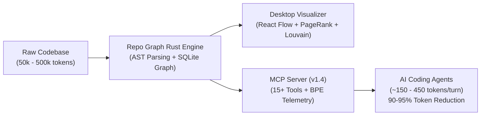

<div align="center">

# 🗺️ Repo Graph

**Offline-First Codebase Dependency Visualizer & Agent-First MCP Server**  
*Cut AI coding agent token consumption and context bloat by **90%+** using Context Engineering and symbol-level granularity.*

[](https://www.rust-lang.org/)
[](https://tauri.app/)
[](https://react.dev/)
[](https://tailwindcss.com/)
[](https://modelcontextprotocol.io/)
[]()
[](LICENSE)

[Features](#-key-features) • [Context Engineering](#-context-engineering--token-economics) • [Quick Start](#-quick-start) • [MCP Client Setup](#-ai-agent--mcp-integration) • [Tool Reference](#-mcp-tool-reference-suite) • [Supported Languages](#-supported-languages--ast-grammars)

</div>

---

## 🌟 Why Repo Graph?

### The Problem: Raw File Dumps & Token Bloat
Modern AI coding agents (Claude Desktop, Cursor, Codex, Gemini/Antigravity, Windsurf) are frequently forced to ingest entire directory trees and raw file contents just to understand dependencies or locate a single function. In mid-to-large repositories, this causes:
- **Massive Token Waste:** Ingesting 50,000–150,000 tokens of irrelevant implementation bodies per interaction.
- **Context Dilution & Hallucinations:** Large file dumps crowd out the model's high-attention reasoning window, causing it to miss critical types and contracts.
- **Ballooning Latency & Cost:** Slower response cycles and unnecessary API expenses.

### The Solution: Context Engineering & Symbol-Level Granularity
**Repo Graph** statically parses your codebase into an in-memory dependency graph and SQLite index (`.repograph/graph.db`), serving a compressed architectural map and precise, symbol-level extraction tools directly to AI coding agents via the **Model Context Protocol (MCP)**.



---

## ⚡ Key Features

### 🖥️ 1. Interactive Desktop Architecture Visualizer
- **Interactive Dependency Node Graph:** Built with React Flow, supporting smooth zoom, pan, auto-layout (Dagre / Force-directed), and hierarchical component exploration.
- **Louvain Community Clustering:** Automatically groups files and packages into high-level architectural domains with cohesion scores and central export hubs.
- **PageRank Centrality & Hotspots:** Identifies the foundational "core" files versus peripheral leaf modules.
- **Blast Radius & Impact Analysis:** Select any file or symbol to visually trace all downstream dependents and incoming callers.
- **Dark / Light Modes & Filters:** Full theme support with Tailwind CSS v4 and instant fuzzy file/symbol searching.

### 🤖 2. Comprehensive 15+ Agent-Facing MCP Tool Suite
- **`repograph_skeleton` (AST Ghost Outlines):** Strips function/method/JSX implementation bodies while retaining imports, exports, TypeScript interfaces, type definitions, class fields, and docstrings. Replaces a 600-line file (~3,500 tokens) with a 35-line structural contract (~180 tokens) for a **95%+ token reduction**.
- **`repograph_trace` (Multi-Hop Static Execution Pipelines):** Traverses cycle-safe recursive SQLite CTE call chains from any API route, handler, or function down $N$ hops (`depth: 1..4`) with exact type signatures, line numbers, and automatic utility sink pruning (`logger.*`, `console.*`, `print`, `panic`).
- **`repograph_node` (Sliced 1-Indexed Reads):** Prohibits full-file dumps by allowing agents to retrieve exact line slices (`start_line`, `end_line`, `with_line_numbers`).
- **`repograph_explore` & `repograph_search`:** Query symbols with `signature_only: true` and strict `limit` bounds to maintain minimal context footprints.
- **Closed-Loop Atomic Mutations (`repograph_edit`, `repograph_write`, `repograph_delete`, `repograph_batch_edit`, `repograph_edit_symbol`):** Performs atomic code replacements with instant synchronous AST re-indexing and edge diff verification (`+N new edges`, `-M broken edges`).

### 📊 3. Live BPE Token Cost Telemetry Engine
- Built-in Tiktoken-grade BPE token counter (`gpt-4o`/`cl100k_base`).
- Tracks input tokens, output tokens, raw file equivalent tokens, net tokens saved, and compression multiplier.
- Automatically appends in-band `[Telemetry: Tool '...' | Out: X tokens | Saved: Y tokens (Zx) | ...]` tags to MCP responses.
- **Intelligent 2,500 Token Budget Throttling:** Automatically compresses oversized payloads into signatures unless `force_full: true` is explicitly requested.

### 🛡️ 4. Autonomous Workspace Governance & Scaffolding
- Automatically detects and provisions `.myrepograph-agent/` in opened repositories.
- Injects the **Context Engineering Prompt Architecture (CEPA-v1.4)** and 3 specialized agent skill suites:
  - `skills/code-review` — Blast radius and regression review.
  - `skills/codebase-design` — Structural patterns and anti-corruption layers.
  - `skills/improve-codebase-architecture` — Visual HTML refactoring reports.
- Idempotently synchronizes `REPO-GRAPH-SYNC-POLICY v1.4` across `AGENTS.md`, `GEMINI.md`, `CLAUDE.md`, and `CHATGPT.md`.

---

## 🏛️ Context Engineering & Token Economics

Repo Graph implements the **Seven-Piece Context Stack** and the **Four-Step Context Lifecycle** to maximize reasoning density:

| Context Layer | What Goes In | How Repo Graph Optimizes It |
| :--- | :--- | :--- |
| **1. Instructions** | System prompts & guardrails | Fixed master policy in `.myrepograph-agent/RULES.md` |
| **2. User Input** | Active task / bug request | User prompt (kept intact) |
| **3. Retrieved Facts** | File contents & dependencies | **90-95% Token Cut:** Ghost skeletons + sliced nodes + CTE traces |
| **4. Tools** | MCP tool schemas | 15 bounded, typed JSON-RPC tool schemas |
| **5. Short-term Notes** | Active task goals & checklist | Offloaded outside context window into `memory/runtime/context.md` |
| **6. Long-term Memory** | Project agreements & architectural rules | Selective retrieval from `knowledge/` and `RULES.md` |
| **7. Output Format** | Structured schemas & code diffs | Atomic MCP mutation tools with edge validation |

---

## 📁 Recommended `.gitignore`

Add the following to your target project's `.gitignore` to avoid committing local caches while sharing team-wide agent rules:

```gitignore
# Repo Graph SQLite database and runtime cache
.repograph/
.myrepograph-agent/memory/runtime/
```

> **Tip:** Commit `.myrepograph-agent/RULES.md` and `.myrepograph-agent/skills/` to your Git repository so all team members and AI coding assistants share the same architectural guardrails and skill suites.

---

## 🌐 Supported Languages & AST Grammars

Repo Graph employs native AST parsers (**SWC** and **Tree-sitter**), never naive regular expressions or runtime code execution:

| Language / Stack | Parser Engine | Capabilities Extracted |
| :--- | :--- | :--- |
| **TypeScript / JavaScript** (`.ts`, `.tsx`, `.js`, `.jsx`, `.mjs`, `.cjs`) | `swc_ecma_parser` | Imports, exports, interfaces, type aliases, classes, Next.js / Remix / Express / Fastify routes, AST ghost skeletons |
| **Python** (`.py`) | `tree_sitter_python` | Imports (`import`, `from ... import`), classes, functions, docstrings, FastAPI / Flask / Django / Litestar routes |
| **Rust** (`.rs`, `Cargo.toml`) | `tree_sitter_rust` + Cargo parser | Modules (`mod`, `use`), structs, enums, traits, `impl` blocks, Actix / Axum routes, Cargo dependencies |
| **Go** (`.go`) | `tree_sitter_go` | Packages, imports, structs, interfaces, methods, functions, Gin / Fiber / Echo routes |
| **Java** (`.java`) | `tree_sitter_java` | Packages, imports, classes, interfaces, records, methods, Spring Boot / Micronaut annotations |
| **Kotlin** (`.kt`, `.kts`) | `tree_sitter_kotlin_ng` | Packages, imports, classes, functions, Ktor DSL / Spring routes |
| **C# / .NET** (`.cs`) | `tree_sitter_c_sharp` | Namespaces, `using` directives, classes, interfaces, structs, ASP.NET Core endpoints |
| **C / C++** (`.c`, `.cpp`, `.h`, `.hpp`, `.cc`) | `tree_sitter_c` / `tree_sitter_cpp` | Includes, functions, classes, structs, namespaces |
| **Swift** (`.swift`) | `tree_sitter_swift` | Imports, protocols, classes, structs, functions |
| **PHP** (`.php`) | `tree_sitter_php` | Namespaces, `use`, classes, interfaces, traits, methods, Symfony / Laravel / Slim attributes |
| **Vue & Svelte** (`.vue`, `.svelte`) | Custom SFC Parser + SWC | Slices `<script>` / `<script setup>`, collapses `<template>` markup |

---

## 🚀 Quick Start

### 📦 Pre-Built Binaries
> **Prefer not to build from source?** Download the latest desktop installer (`.msi`, `.dmg`, `.AppImage` / `.deb`) and standalone `mcp_server` binaries directly from [**GitHub Releases**](https://github.com/chenchu-krishna-akkarapalli/repo-graph/releases).

---

### Prerequisites & Native C/C++ Build Tools
Compiling the 10+ Tree-sitter AST parsers and Tauri desktop backend from source requires:
- **Node.js:** 18.0+ & `npm` / `pnpm`
- **Rust Toolchain:** `rustc` and `cargo` 1.80+ ([Install Rust](https://rustup.rs/))
- **C/C++ Compiler Toolchains:**
  - **Windows:** [Visual Studio C++ Build Tools](https://visualstudio.microsoft.com/visual-cpp-build-tools/) (select *"Desktop development with C++"*) or MinGW / Clang.
  - **Linux (Ubuntu/Debian):** `sudo apt update && sudo apt install -y build-essential libwebkit2gtk-4.0-dev libayatana-appindicator3-dev librsvg2-dev`
  - **macOS:** `xcode-select --install`

---

### 1. Clone & Install Dependencies
```bash
git clone https://github.com/chenchu-krishna-akkarapalli/repo-graph.git
cd repo-graph
npm install
```

### 2. Run Desktop Visualizer (Dev Mode)
```bash
# Runs frontend Vite dev server with Tauri desktop container
npm run tauri dev
```

### 3. Build Release Standalone MCP Server Binary
```bash
cd src-tauri
cargo build --release --bin mcp_server
```
The compiled binary will be located at:
- **Windows:** `src-tauri/target/release/mcp_server.exe`
- **macOS / Linux:** `src-tauri/target/release/mcp_server`

---

## 🔌 AI Agent & MCP Integration

Repo Graph exposes its entire dependency index and mutation engine via the standard Model Context Protocol over `stdio`.

### CLI Arguments & Options
The `mcp_server` executable supports both CLI flags and environment variables:
```bash
mcp_server [OPTIONS] [REPO_ROOT]

Options:
  -r, --root <PATH>     Target project directory (defaults to current working directory)
  -t, --tools <TOOLS>   Comma-separated list of enabled tools, or 'all'
  -h, --help            Print help

Commands:
  index <PATH>          Walk and parse the repo into .repograph/graph.db
  install-rules <PATH>  Provision agent rules into workspace
```

---

### 1. Claude Desktop (`claude_desktop_config.json`)
Add the following to `%APPDATA%\Claude\claude_desktop_config.json` (Windows) or `~/Library/Application Support/Claude/claude_desktop_config.json` (macOS):

```json
{
  "mcpServers": {
    "repo-graph": {
      "command": "C:\\path\\to\\repo-graph\\src-tauri\\target\\release\\mcp_server.exe",
      "args": ["-r", "C:\\path\\to\\your\\target-project"],
      "env": {
        "REPOGRAPH_MCP_TOOLS": "all"
      }
    }
  }
}
```

### 2. Cursor / VS Code MCP Settings
In `.cursor/mcp.json` or `.vscode/settings.json`:
```json
{
  "mcp": {
    "servers": {
      "repo-graph": {
        "command": "C:/path/to/repo-graph/src-tauri/target/release/mcp_server.exe",
        "args": ["-r", "${workspaceFolder}"],
        "env": {
          "REPOGRAPH_MCP_TOOLS": "all"
        }
      }
    }
  }
}
```

### 3. Antigravity / Gemini / Codex Desktop
In your agent's MCP configuration settings:
```toml
[mcp_servers.repo-graph]
command = "C:/path/to/repo-graph/src-tauri/target/release/mcp_server.exe"
args = ["-r", "C:/path/to/your/project"]
env = { REPOGRAPH_MCP_TOOLS = "all" }
```

---

## 🛠️ MCP Tool Reference Suite

| Category | Tool Name | Parameters | Purpose & Token Savings |
| :--- | :--- | :--- | :--- |
| **Architecture & Discovery** | `repograph_status` | *None* | Verifies connection, sync state (`Synced`/`Desynced`), and session metadata. |
| | `repograph_files` | `scope`, `domain`, `top_k`, `min_rank`, `sort_by` | Returns prioritized file manifest with PageRank and Louvain domain filtering. |
| | `repograph_domains` | *None* | Returns architectural domain clusters with cohesion scores and export hubs. |
| | `repograph_search` | `query`, `limit`, `signature_only`, `exact_symbol_only` | High-speed symbol and FTS code search with intelligent bounds. |
| | `repograph_explore` | `symbols`, `signature_only`, `compact_edges` | Bundled multi-symbol call graph and signatures in a single request. |
| **Structural Outlines & Slices** | `repograph_skeleton` | `path` | **~95%+ token reduction.** AST ghost file stripping all method/JSX bodies while preserving interfaces, docstrings, and class fields. |
| | `repograph_node` | `path`, `symbol`, `start_line`, `end_line`, `with_line_numbers` | Precision 1-indexed sliced file/symbol reading with line numbers. |
| **Execution Tracing & Blast Radius** | `repograph_trace` | `entrypoint`, `depth` | **~80%+ token reduction.** Cycle-safe multi-hop recursive CTE call trace (`depth: 1..4`) with type signatures and sink pruning. |
| | `repograph_impact` | `symbol`, `path` | Calculates full downstream blast radius before executing modifications. |
| | `repograph_callers` | `symbol`, `path` | Identifies all incoming callers across the codebase. |
| | `repograph_callees` | `symbol`, `path` | Identifies all outgoing function and module dependencies. |
| **Atomic Mutations** | `repograph_edit` | `path`, `target_content`, `replacement_content` | Atomic search-and-replace with rollback safety and instant AST re-indexing. |
| | `repograph_batch_edit`| `patches: [{path, target_content, replacement_content}]` | Multi-file transactional edits with pre-validation rollback guarantees. |
| | `repograph_edit_symbol`| `path`, `symbol`, `new_code` | Scoped AST-level symbol body replacement. |
| | `repograph_write` | `path`, `content` | Creates/overwrites files and updates the graph index. |
| | `repograph_delete` | `path` | Deletes files and cascades edge removals. |

---

## 🧩 Architecture & Repo Layout

```
├── .myrepograph-agent/         # Agent scaffolding, CEPA-v1.4, RULES.md, memory/runtime/
├── src/                         # Frontend React 18 Application
│   ├── components/              # React Flow canvas, Node renderers, TelemetryHUD, Toolbar
│   ├── lib/                     # Graph algorithms, Louvain clustering, Tauri IPC bridge
│   └── store.ts                 # Zustand reactive UI state store
├── src-tauri/                   # High-Performance Rust Backend (Tauri Core)
│   ├── src/
│   │   ├── bin/mcp_server.rs    # Standalone stdio MCP server entrypoint & CLI argument parser
│   │   ├── skeleton.rs          # Universal AST Ghost Outline Stripper (SWC + Tree-sitter)
│   │   ├── db.rs                # SQLite schema, recursive CTE execution tracer, FTS5
│   │   ├── mcp_server.rs        # JSON-RPC MCP server with live BPE telemetry injection
│   │   ├── rule_injector.rs     # Multi-harness policy provisioner (v1.4)
│   │   ├── agent_scaffold.rs    # Auto-scaffolding engine (CEPA-v1.4 + skills)
│   │   ├── telemetry.rs         # BPE token counter & temporal turn clustering
│   │   ├── rank.rs              # PageRank centrality & Adamic-Adar neighborhood scoring
│   │   ├── cluster.rs           # Louvain modularity community detection
│   │   ├── walker.rs            # Multi-threaded file tree traversal & secret filter
│   │   ├── watcher.rs           # Real-time file system watcher & sync engine
│   │   └── parsers/             # 12+ language-specific AST extractors
│   ├── Cargo.toml               # Rust dependencies & Tree-sitter grammar crates
│   └── tauri.conf.json          # Tauri application bundle configuration
└── docs/                        # Specifications, PRD, Playbook, UI Architecture
```

---

## 🧪 Testing & Verification

Repo Graph maintains rigorous automated test suites across both the Rust backend and React frontend:

```bash
# Run all 176 Rust backend tests (parsers, skeletons, CTE traces, MCP protocol, telemetry)
cd src-tauri
cargo test --lib

# Run all 42 Vitest frontend tests (clustering, layout, store persistence, graph cache)
npm test -- --run
```

---

## 📄 License

This project is licensed under the [MIT License](LICENSE).

---

<div align="center">
Built with ❤️ for developers and autonomous AI coding agents.
</div>
