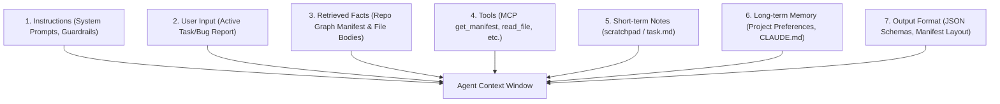

# Product Requirements Document (PRD): Repo Graph

## 1. Overview & Vision

**Repo Graph** is a local, offline-first developer tool that statically analyzes codebases, constructs dynamic dependency graphs, and serves compressed "project architecture maps" to AI coding agents (such as Claude Code, Cursor, or Claude Desktop). 

### The Problem
AI coding agents are often forced to ingest entire repositories to understand project structure and dependencies. For mid-to-large codebases, this results in:
- **Massive Token Waste:** Ingesting 100K+ tokens of irrelevant file content per turn.
- **Context Bloat & Dilution:** Diluting the agent's attention, causing it to hallucinate or miss subtle details.
- **High Latency & Costs:** Slower response times and ballooning API costs.

### The Solution
Instead of providing the whole repository, Repo Graph enables **Context Engineering**. It provides the agent with:
1. A highly compressed, structured architectural map (manifest) outlining file relationships, exports, and routes.
2. A suite of precise tools to query details on-demand (`read_file`, `find_dependents`, etc.).

By applying this paradigm, Repo Graph cuts agent context and token usage by **90%+** on large codebases.

---

## 2. Context Engineering Integration

Repo Graph is architected specifically around the principles of **Context Engineering**, which treats the AI's context window as a precious, high-cost short-term memory.

### 2.1 The Seven-Piece Context Stack
Repo Graph partitions and optimizes inputs into the following layers of the agent's context:

1. **Instructions:** The system prompt instructs the agent to never guess code contents and enforce reliance on the graph tools.
2. **User Input:** The target task (e.g., *"Fix the login button routing"*).
3. **Retrieved Facts:** **(Optimized by Repo Graph)** 
   - Initial state: A low-token compressed map of the repository's file structure, exports, and edges.
   - Active state: Only the exact contents of the 1–5 files relevant to the task, retrieved dynamically via `read_file`.
4. **Tools:** The Repo Graph MCP server exposes specific, limited tools (`get_manifest`, `read_file`, `find_dependents`, `find_route`) with strict boundaries.
5. **Short-term Notes:** The agent maintains a list of files explored and pending analysis (externalized to a scratchpad/`task.md` to prevent context bloat).
6. **Long-term Memory:** Stable coding conventions and project agreements loaded from `CLAUDE.md` or `PLAYBOOK.md`.
7. **Output Format:** Deterministic Markdown format representing the project map.

---

### 2.2 The Four-Step Context Management Framework
To maintain context sanity in multi-turn interactions, Repo Graph facilitates a strict context lifecycle:

| Lifecycle Step | Framework Action | Repo Graph Implementation / Best Practice |
| :--- | :--- | :--- |
| **1. Write (Scratchpad)** | Store intermediate planning, checklists, and open questions outside active memory. | Agents should record graph traversal steps and file dependencies in a local `task.md` scratchpad rather than listing them in chat history. |
| **2. Select (Retrieval)** | Selectively retrieve only high-signal facts relevant to the active turn. | Agents run `get_manifest()` to view the system map, identify the relevant modules, and perform targeted `read_file(path)` calls for *only* those modules. |
| **3. Compress (Summarization)** | Compress structure representations and drop redundant or stale histories. | The Repo Graph backend automatically collapses unaffected directories into single summary lines when the manifest exceeds the configured token budget (e.g., 500 lines). |
| **4. Isolate (Sandboxing)** | Divide complex, multi-component workflows into specialized subagents. | A coordinator agent delegates separate parts of the dependency graph (isolated subgraphs) to specialized subagents to prevent context crosstalk. |

---

## 3. Product Features & Functional Requirements

### 3.1 Backend Core Engine (Rust)
- **FR-1.1: File Tree Walker**
  - Traverses the local codebase using a multi-threaded traversal library (e.g., `ignore` or `walkdir`).
  - Automatically ignores noise directories (`node_modules`, `.git`, `dist`, `build`, `target`, lockfiles, and binary assets).
  - Performance: Walk and index 10,000 files in under 1.0 second.
- **FR-1.2: Language-Specific AST Parsers**
  - Parses JavaScript, TypeScript, and TSX using an AST-based parser (`swc_ecma_parser`).
  - Extract imports, exports, and relative/absolute dependency paths.
  - Parse Python code for imports (`import`/`from ... import ...`) and FastAPI/Flask route decorators.
  - Parse Rust projects (`Cargo.toml` workspace + module declaration `mod` and usage `use`).
- **FR-1.3: Graph Construction**
  - Builds a directed graph mapping file nodes to dependency edges (`import`, `require`, `mod`, `use`, `route`).
  - Computes degrees (`in_degree`, `out_degree`) to surface central hub files.

### 3.2 Frontend Visualizer (React + Tauri)
- **FR-2.1: Graph Rendering**
  - Displays nodes (files) and edges (dependencies) using React Flow or D3.js.
  - Interactive panning, zooming, and node layout sorting.
- **FR-2.2: Node Detail Panel**
  - Clicking a node displays: file size, exports, direct imports, and dependents (files importing this one).
- **FR-2.3: Change Impact Simulator**
  - Visually highlights all downstream nodes affected when a particular file is modified.

### 3.3 Agent API & MCP Server
- **FR-3.1: get_manifest Tool**
  - Returns the compressed markdown or JSON representation of the codebase.
  - Supports `scope` parameter (glob pattern) to return a focused subgraph manifest.
- **FR-3.2: read_file Tool**
  - Reads raw file contents. Validates that paths do not escape the repository root.
- **FR-3.3: find_dependents Tool**
  - Returns all files that directly depend on the target file.

---

## 4. Technical & Security Guardrails

> [!IMPORTANT]
> **FR-4.1: Read-Only Constraint**
> The Repo Graph backend and MCP server must never write, execute, or modify project files. It operates purely as a static query layer.

> [!WARNING]
> **FR-4.2: No Code Execution**
> Dynamic imports or route inspection must never execute or `eval` user code. All mappings must be resolved through static analysis.

> [!CAUTION]
> **FR-4.3: Path Traversal Prevention**
> Every path argument received by the MCP server (`read_file`, `find_dependents`, etc.) must be canonicalized and checked to ensure it resides strictly within the repository root directory. Any attempt to traverse outside the root must be immediately rejected with an error.

---

## 5. Walkthrough & Validation Plan

### 5.1 Automated Verification
- **Unit Tests:** Verify individual parser extractors against standard fixtures (nested folders, relative imports, syntax variations).
- **CI Budget Assertions:** Assert that the manifest output of a fixture repository does not exceed 2-3K tokens and fails builds if it exceeds the token limit by 20%.

### 5.2 Manual Verification Scenario
1. Launch the Repo Graph Tauri app and MCP server on a target project.
2. Connect Claude Code or Claude Desktop.
3. Prompt: *"Find which file handles the `/api/login` endpoint and update its validation schema."*
4. Verify that:
   - The agent queries the manifest.
   - The agent resolves the route `/api/login` using `find_route` or looking up route markers.
   - The agent calls `read_file` only for the matching endpoint file and its direct validation dependency.
   - Total tokens consumed in the turn remain under 5,000 tokens instead of ingesting the entire codebase.
