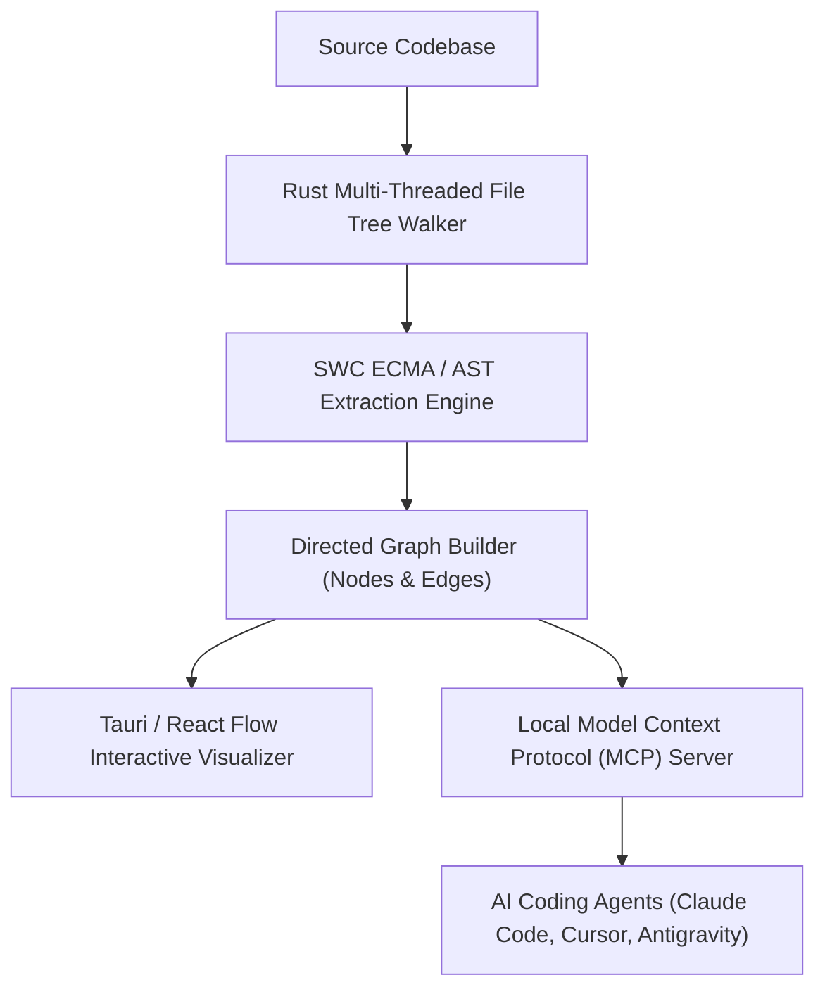

# Product Exposure Manifest & Web Integration Specification

**Company:** INNOVIXINFINITE - PRIVATE LIMITED  
**Product:** Repo Graph Engine (Offline-First AI Context Engineering & AST Graph Server)  
**Document Version:** `v1.0.0`  
**Status:** Canonical Release Spec  
**Target Exposure Platform:** INNOVIXINFINITE Developer Products Showcase & Open-Source Ecosystem Portal  

---

## 1. Company Metadata & Corporate Vision

| Field | Corporate Specification |
| :--- | :--- |
| **Legal Entity Name** | **INNOVIXINFINITE - PRIVATE LIMITED** |
| **Corporate Mission** | *"Solving Global AI Context Bloat & Developer Productivity via Offline-First Static Parsing"* |
| **Core Product Line** | Repo Graph Engine & Agentic Integration Framework |
| **Licensing Model** | Open-Source Core (MIT / Apache-2.0 Dual License) + Enterprise Local Sidecar Options |
| **Target Audience** | AI Engineers, Systems Architects, DevTools Developers, Agentic Workflow Engineers |
| **Primary Repository** | `https://github.com/innovixinfinite/repo-graph` |

### Executive Mission Statement
**INNOVIXINFINITE - PRIVATE LIMITED** is dedicated to engineering high-performance software tools that eliminate systemic inefficiencies in AI-assisted software development. Large Language Models (LLMs) and AI coding agents consume massive token budgets re-reading entire repositories to perform localized edits. **Repo Graph** solves this problem by providing an offline-first, high-density architectural graph engine that compresses codebase context by **~90%+**, reducing latency, cost, and hallucination rates for agentic developer tools.

---

## 2. Product Technical Specifications

### 2.1 Core Architectural Pillars



### 2.2 Subsystem Breakdown

#### 1. Backend Core Engine (Rust & Tauri Core)
- **Multi-Threaded File Tree Traversal:** High-throughput workspace walker capable of indexing 10,000+ files in under 1.0 second. Ignores `node_modules`, `.git`, build output, lockfiles, and binary assets.
- **AST Parsing Battery:**
  - **JavaScript / TypeScript / JSX / TSX:** Powered by `swc_ecma_parser` for exact AST symbol extraction, imports, exports, and call edges without execution.
  - **Python Parser:** AST-based import extractor (`import`, `from ... import ...`) with decorator inspection for FastAPI/Flask HTTP route handlers.
  - **Rust Workspace Parser:** `Cargo.toml` module tree resolver and `mod`/`use` dependency graph constructor.
- **Directed Graph Representation:** Constructs in-memory directed graphs computing `in_degree`, `out_degree`, central hubs, and transitive dependency impact graphs.

#### 2. Frontend Visualizer (React + Tailwind CSS v4.0 + Tauri)
- **Interactive Graph Canvas:** Built with React Flow & D3.js for dynamic node-edge layouts, panning, zooming, and sub-graph isolation.
- **Node Detail & Blast Radius Panel:** Displays symbol signatures, file export structures, and interactive downstream impact simulation.

#### 3. Agent Integration & Local MCP Server
- Exposes standardized tools over standard input/output (stdio) or SSE for Model Context Protocol (MCP) clients:
  - `repograph_status()`: Verifies workspace index synchronization and health.
  - `repograph_files(scope)`: Serves compressed directory manifests.
  - `repograph_search(query)`: Performs prefix and sub-word tokenized symbol lookups.
  - `repograph_explore(symbols, signature_only)`: Delivers AST signatures and collapsed call graphs.
  - `repograph_impact(path, symbol)`: Calculates transitive refactoring impact.
  - `read_file(path)`: Provides safe, canonicalized read access within repository bounds.

---

## 3. Verified Performance & Token Benchmarks

Based on empirical benchmarks documented in [`BENCHMARK_REPORT.md`](file:///c:/My-pro/project-map/docs/BENCHMARK_REPORT.md):

| Query / Exploration Paradigm | Token Consumption | Context Savings | Execution Latency |
| :--- | ---: | ---: | ---: |
| **Naive Full File Ingestion** (7 whole files) | **27,620 tokens** | 0% (Baseline) | ~4,200 ms |
| **Repo Graph Full AST Body Retrieval** | **3,427 tokens** | 87.59% reduction | ~320 ms |
| **Repo Graph Signature-Only Mode (`signature_only: true`)** | **398 tokens** | **98.56% reduction** | **~45 ms** |

> [!IMPORTANT]
> **Average Context Optimization:** On mid-to-large multi-module repositories (10k–100k LOC), Repo Graph consistently cuts agent context ingestion by **~90%+**.

---

## 4. Products Page Integration Specification (INNOVIXINFINITE Web Portal)

This section specifies the schemas, UI components, and API integration guidelines for embedding **Repo Graph** into the official **INNOVIXINFINITE - PRIVATE LIMITED** products showcase website.

### 4.1 Data Schema (`product-schema.json`)

```json
{
  "$schema": "http://json-schema.org/draft-07/schema#",
  "title": "InnovixInfiniteProductListing",
  "type": "object",
  "properties": {
    "id": { "type": "string", "enum": ["repo-graph"] },
    "name": { "type": "string", "example": "Repo Graph" },
    "tagline": { "type": "string", "example": "Offline-First AI Context Engineering & Code Base AST Graph Engine" },
    "company": { "type": "string", "example": "INNOVIXINFINITE - PRIVATE LIMITED" },
    "category": { "type": "string", "example": "AI Infrastructure & Developer Productivity" },
    "openSource": { "type": "boolean", "default": true },
    "license": { "type": "string", "example": "MIT / Apache-2.0" },
    "version": { "type": "string", "example": "1.0.0" },
    "metrics": {
      "type": "object",
      "properties": {
        "contextReductionPercent": { "type": "number", "example": 98.56 },
        "tokenSavingsRatio": { "type": "string", "example": "398 tokens vs 27,620 tokens" },
        "indexingSpeed": { "type": "string", "example": "< 1.0s for 10,000 files" }
      }
    },
    "techStack": {
      "type": "array",
      "items": { "type": "string" },
      "example": ["Rust", "SWC AST Parser", "Tauri", "React", "Tailwind CSS v4.0", "Model Context Protocol (MCP)"]
    },
    "links": {
      "type": "object",
      "properties": {
        "github": { "type": "string", "format": "uri" },
        "documentation": { "type": "string", "format": "uri" },
        "mcpPackage": { "type": "string" }
      }
    }
  },
  "required": ["id", "name", "company", "tagline", "openSource", "metrics", "techStack"]
}
```

### 4.2 React UI Component Architecture

```tsx
// Component: RepoGraphProductCard.tsx
// Designed for INNOVIXINFINITE Web Platform (Next.js / React + Tailwind CSS v4.0)

import React from 'react';

export interface ProductProps {
  name: string;
  tagline: string;
  contextReduction: number;
  tokenSavings: string;
  techStack: string[];
  githubUrl: string;
  docsUrl: string;
}

export const RepoGraphProductCard: React.FC<ProductProps> = ({
  name = "Repo Graph",
  tagline = "Offline-First AI Context Engineering & AST Graph Engine",
  contextReduction = 98.56,
  tokenSavings = "398 tokens vs 27,620 tokens",
  techStack = ["Rust", "SWC AST", "Tauri", "React", "MCP"],
  githubUrl = "https://github.com/innovixinfinite/repo-graph",
  docsUrl = "/docs/product-exposure.md"
}) => {
  return (
    <div className="rounded-2xl bg-slate-900 border border-slate-800 p-8 shadow-2xl hover:border-indigo-500/50 transition-all duration-300">
      <div className="flex items-center justify-between mb-4">
        <span className="text-xs font-semibold tracking-wider text-indigo-400 uppercase bg-indigo-500/10 px-3 py-1 rounded-full border border-indigo-500/20">
          INNOVIXINFINITE Core Product
        </span>
        <span className="text-xs text-emerald-400 font-mono bg-emerald-500/10 px-2.5 py-1 rounded-md">
          Open Source (MIT)
        </span>
      </div>
      
      <h2 className="text-3xl font-bold text-white mb-2">{name}</h2>
      <p className="text-slate-400 text-sm mb-6 leading-relaxed">{tagline}</p>
      
      {/* Benchmark Metric Highlight */}
      <div className="grid grid-cols-2 gap-4 mb-6 p-4 rounded-xl bg-slate-950/60 border border-slate-800/80">
        <div>
          <div className="text-xs text-slate-500 font-medium uppercase">Context Reduction</div>
          <div className="text-2xl font-extrabold text-indigo-400 font-mono">~{contextReduction}%</div>
        </div>
        <div>
          <div className="text-xs text-slate-500 font-medium uppercase">Token Benchmark</div>
          <div className="text-sm font-semibold text-slate-300 font-mono mt-1">{tokenSavings}</div>
        </div>
      </div>

      {/* Tech Stack Pills */}
      <div className="flex flex-wrap gap-2 mb-8">
        {techStack.map((tech, idx) => (
          <span key={idx} className="text-xs font-mono text-slate-300 bg-slate-800/80 px-2.5 py-1 rounded-md">
            {tech}
          </span>
        ))}
      </div>

      {/* CTA Actions */}
      <div className="flex items-center gap-4">
        <a
          href={githubUrl}
          target="_blank"
          rel="noopener noreferrer"
          className="flex-1 text-center py-2.5 px-4 rounded-xl bg-indigo-600 hover:bg-indigo-500 text-white font-medium text-sm transition-colors shadow-lg shadow-indigo-600/25"
        >
          View on GitHub
        </a>
        <a
          href={docsUrl}
          className="flex-1 text-center py-2.5 px-4 rounded-xl bg-slate-800 hover:bg-slate-700 text-slate-200 font-medium text-sm transition-colors border border-slate-700"
        >
          Documentation
        </a>
      </div>
    </div>
  );
};
```

---

## 5. Context Engineering Prompt Master Reference

Below is the embedded Context Engineering Prompt Master Reference constructed strictly in accordance with the 7-Piece Context Stack and 4-Step Context Management Framework:

> [!NOTE]
> Standalone prompt file available at [`docs/product-exposure-prompt.md`](file:///c:/My-pro/project-map/docs/product-exposure-prompt.md).

### The Seven-Piece Stack Matrix

```
1. INSTRUCTIONS     -> Require static graph querying; disable blind grep/glob.
2. USER INPUT       -> Active engineering goal / feature request.
3. RETRIEVED FACTS  -> SWC AST outputs, symbol signatures, caller-callee edges.
4. TOOLS            -> repograph_files, repograph_search, repograph_explore, repograph_impact.
5. SHORT-TERM NOTES -> Managed in external file (memory/runtime/context.md).
6. LONG-TERM MEMORY -> UI_UX_DESIGN_SYSTEM.md, AGENTS.md, PLAYBOOK.md.
7. OUTPUT FORMAT    -> Structured JSON or standard unified code diff.
```

### The Four-Step Lifecycle Execution Protocol

1. **Write (Scratchpad):** Write active task state to `memory/runtime/context.md` instead of filling turn transcripts.
2. **Select (Retrieval):** Fetch AST signatures via `repograph_explore(signature_only: true)` (consuming ~398 tokens vs ~27,620 tokens).
3. **Compress (Summarization):** Collapse redundant subtree graphs into path summary nodes.
4. **Isolate (Sandboxing):** Partition large codebase audits across isolated subagents.

---
