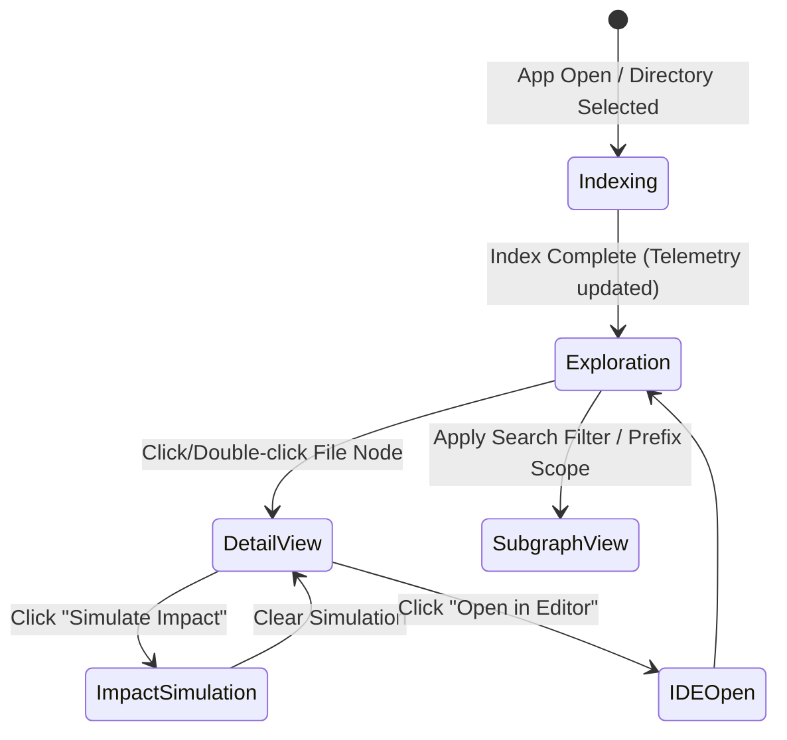

# UI Architecture Layout & User Workflow Specification

This document defines the interface layout, visual styling system, component hierarchy, and interactive workflows for the **Repo Graph** frontend app. Developers and coding agents must adhere strictly to this design blueprint to ensure a high-refresh, responsive, and intuitive UX.

---

## 1. Interface Grid & Layout Architecture

The Repo Graph app layout uses a 4-pane layout system designed to accommodate multi-project navigation and local folder browsing.

```
+------------------------------------------------------------------------------------+
|  Top Navigation & Global Control Toolbar                                            |
|  [Open Folder (Btn)] [Current Project Root /path/to/repo]   [Search... (Cmd+K)]     |
+----------------------+-----------------------------+-------------------------------+
|                      |                             |                               |
|                      |                             |  Detail Panel Sidebar         |
|  Left Sidebar        |                             |  +-------------------------+  |
|  (File Explorer)     |  Central Graph Canvas       |  | Tab: Overview | Depend...  |  |
|  - Open Folder button|  (React Flow Canvas)        |  +-------------------------+  |
|  - Folder/File Tree  |                             |  | File: /src/walker.rs    |  |
|  - Filter checkmarks |  - Visual nodes & edges     |  | Size: 4.2 KB            |  |
|                      |  - Zoom / pan workspace     |  | [ Simulate Impact ]     |  |
|                      |                             |  +-------------------------+  |
+----------------------+-----------------------------+-------------------------------+
|  Status Bar: 12,402 Files | Index Time: 420ms | GPU Memory: 12MB                   |
+------------------------------------------------------------------------------------+
```

### Layout Grid Specifications
1. **Top Toolbar:** Fixed height of `56px`. Houses the native "Open Folder" trigger, current project path text, fuzzy search, and watcher status.
2. **Left Sidebar (File Explorer):** Collapsible panel with resizable width boundary between `240px` and `320px` (defaults to `260px`). Displays a folder/file tree of the active workspace.
3. **Central Canvas:** Flex-fill area. Serves as the interactive work area for the node graph.
4. **Detail Sidebar:** Collapsible panel with resizable width boundary between `320px` and `440px` (defaults to `360px`). Placed on the right to match Figma's property inspector.
5. **Status Bar:** Fixed height of `28px` at the bottom, conveying system telemetry.

---

## 2. Visual Design System & Styling Tokens

A consistent, premium dark-mode palette is enforced to prevent visual fatigue. Colors are selected for clear contrast and structural semantics:

### 2.1 Color Tokens
- **Backgrounds:**
  - App Canvas Base: `#0D0F12` (deep dark slate)
  - Sidebar/Toolbar Backgrounds: `#12161A` with a subtle backdrop blur (`glassmorphism`)
  - Border Accents: `#1E252D`
- **Semantic Code Nodes:**
  - JavaScript / TypeScript: Node background `#102A45`, border `#2680EB` (TypeScript Blue)
  - Python: Node background `#14321A`, border `#2DA44E` (Python Green)
  - Rust: Node background `#381F10`, border `#E05B14` (Rust Orange)
  - collapsed Folders: Node background `#20252C`, border `#485464` (Neutral Gray)
- **Active Selection & Focus States:**
  - Selected Node Border: `#A371F7` (Interactive Purple)
  - Active Dependent Paths: `#EA605C` (Soft Warning Red)
  - Active Dependency Paths: `#FFC93C` (Warning Yellow)
- **System Status Indicators:**
  - Synced / Active: `#2EA043`
  - Indexing / Working: `#F2C94C`
  - Disconnected / Stale: `#EA605C`

### 2.2 Typography
- **Core Font:** Inter, Outfit, or system-default sans-serif.
- **Code Symbols / Links:** JetBrains Mono or Fira Code (`12px` font size with strict tracking).

### 2.3 Tailwind CSS v4.0 Integration
The app uses Tailwind CSS v4.0 with a CSS-first configuration. Styling tokens must be defined inside `src/index.css` using the new `@theme` directive, avoiding the legacy `tailwind.config.js` approach:
```css
@import "tailwindcss";

@theme {
  --color-canvas-base: #0D0F12;
  --color-panel-bg: #12161A;
  --color-accent-border: #1E252D;
  --color-active-purple: #A371F7;
  --color-impact-red: #EA605C;
  --color-impact-yellow: #FFC93C;

  --color-node-ts-bg: #102A45;
  --color-node-ts-border: #2680EB;
  --color-node-py-bg: #14321A;
  --color-node-py-border: #2DA44E;
  --color-node-rs-bg: #381F10;
  --color-node-rs-border: #E05B14;
}
```
This enables utility class usage (such as `bg-canvas-base`, `text-active-purple`, or `border-node-ts-border`) across React Flow custom nodes and sidebar inspectors.

---

## 3. Frontend Component Hierarchy

The codebase frontend is structured into modular components:

```
src/
├── App.tsx                   # App shell laying out Toolbar, Canvas, and Sidebar
├── main.tsx                  # Entry point with global state providers
├── index.css                 # Global styling tokens and keyframe animations
├── components/
│   ├── TopToolbar.tsx        # Search input, watchers, filters
│   ├── GraphCanvas.tsx       # React Flow container wrapping custom nodes
│   ├── DetailSidebar.tsx     # Information panel, tab-switcher, and action controls
│   ├── StatusBar.tsx         # Bottom status/telemetry bar
│   └── nodes/
│       ├── CustomFileNode.tsx   # Custom React Flow component for file cards
│       ├── CustomFolderNode.tsx # Collapsed visual directory container
│       └── EdgeHighlight.tsx    # Edge-rendering customizations
```

---

## 4. User Workflows & State Machine

The interface adapts dynamically based on five primary workflows:



### 4.1 Indexing Workflow (Cold Boot)
1. User opens the application or selects a project folder.
2. The UI renders a **Skeleton Loading state** for the canvas and sidebar.
3. Top Status displays a pulsing Yellow dot: `Indexing [Progress Bar]`.
4. As soon as the Rust backend walker finishes, the canvas animates the nodes using a force-directed layout, transitioning the status to green: `Watching (Synced)`.

### 4.2 Exploration Workflow (Familiar Canvas Navigation)
1. **Pan/Zoom:** Panning is achieved by click-dragging the background. Zooming is mouse wheel scroll.
2. **Hover States:** Hovering a file node temporarily raises its Z-index, highlights its name, and dims all other nodes not directly connected to it by a dependency edge (reduces visual noise).
3. **Fuzzy Search:** Pressing `Cmd+K` (macOS) or `Ctrl+K` (Windows/Linux) opens a floating search overlay. Typing triggers sub-100ms updates, highlighting matches on the canvas.

### 4.3 Deep Inspection Workflow
1. User clicks or double-clicks a file node on the canvas.
2. The graph centers on the clicked node (`Doherty Threshold` compliant, transition duration `200ms`).
3. The **Detail Panel Sidebar** expands and updates immediately:
   - **Overview Tab:** Shows file size, line counts, exports list (with search filter if exports exceed 10).
   - **Dependencies Tab:** Lists files this node imports. Hovering a path in the list highlights its edge.
   - **Impact Tab:** Lists downstream dependents.

### 4.4 Change Impact Simulation (The "What If" Scenario)
1. From the Detail Sidebar, the user clicks the `Simulate Impact` button.
2. The canvas enters **Impact State**:
   - The selected node pulses with a warning outline.
   - The system walks the graph forward to find all downstream dependent modules.
   - All affected nodes are color-coded Red, and their linking edges flash red.
   - The sidebar lists the exact count of affected files (e.g., *"Modifying this file affects 14 files"*).
3. Clicking `Clear Simulation` restores the standard graph layout.

---

## 5. Implementation Rules for UI Engineers

- **Rule 1 (FPS target):** Canvas render pipelines must hit a steady **60 FPS** (120 FPS on high refresh displays). Avoid triggering React state updates on every cursor drag. Use canvas libraries that run in-canvas render updates outside React's render loop (such as React Flow with zustand selectors).
- **Rule 2 (Search latency):** The search bar must use a local fuzzy search index (like `fuse.js` or Rust-backed WASM queries) to return results in under **50ms**.
- **Rule 3 (Dampened Animations):** All camera movements (pan-to-node, fit-view) must use dampened springs (`stiffness: 150`, `damping: 20`) rather than linear transitions to feel premium and natural.
